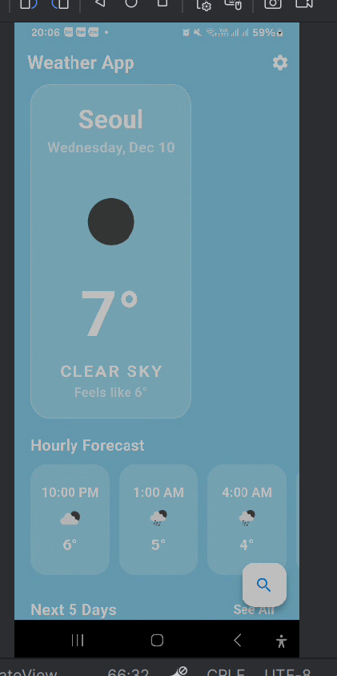
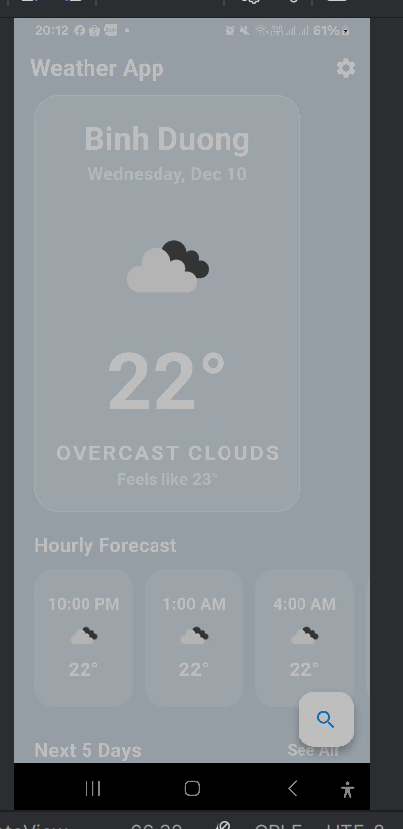
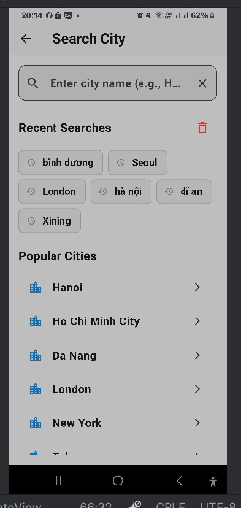
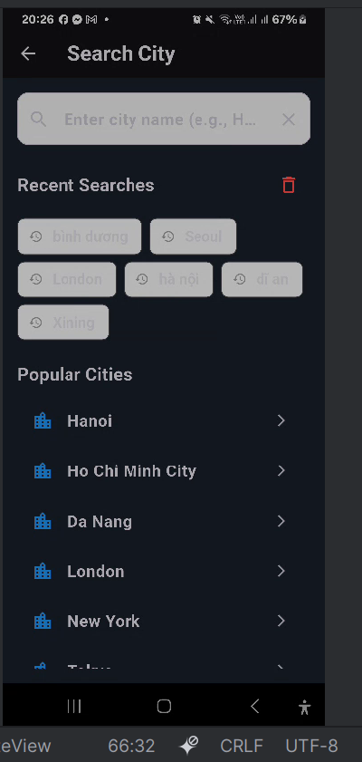
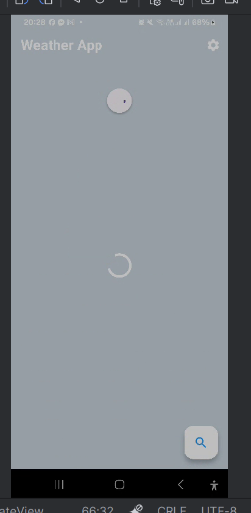
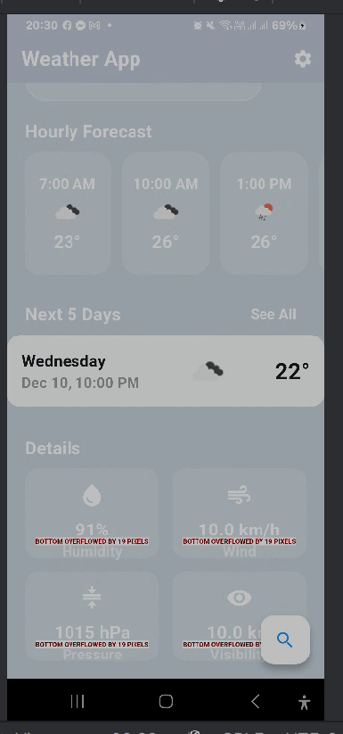
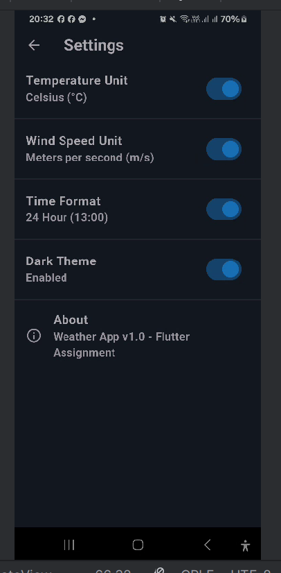
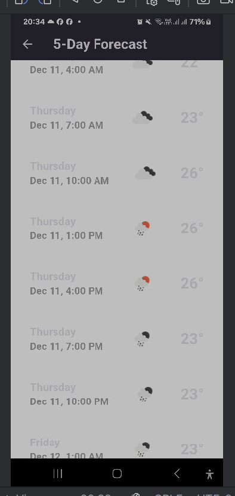

Weather Forecast App – Flutter

Ứng dụng Weather Forecast App được xây dựng bằng Flutter, sử dụng OpenWeatherMap API để hiển thị thông tin thời tiết theo thời gian thực. Ứng dụng hỗ trợ xem thời tiết hiện tại, dự báo theo giờ, dự báo 7 ngày, tìm kiếm thành phố và lưu địa điểm yêu thích.

link video của em:

https://drive.google.com/file/d/1gV9CodSmd9wNtfMBbcSn1nYbhQgE9-IP/view?usp=sharing

1. Chức năng chính

1.1. Thời tiết hiện tại

Nhiệt độ, cảm nhận, trạng thái thời tiết.

Độ ẩm, áp suất, tầm nhìn.

Tốc độ gió và hướng gió.

Chỉ số UV.

Thời điểm mặt trời mọc và lặn.

Giao diện thay đổi theo điều kiện thời tiết (nắng – mưa – nhiều mây – ban đêm).

1.2. Dự báo theo giờ và 7 ngày

Hiển thị nhiệt độ theo giờ.

Dự báo 7 ngày với nhiệt độ cao/thấp và mô tả chi tiết.

1.3. Tìm kiếm & quản lý địa điểm

Tìm kiếm theo tên thành phố.

Lưu địa điểm yêu thích.

Lưu lịch sử tìm kiếm.

Tự động lấy vị trí người dùng bằng GPS.

1.4. Thiết lập

Đổi đơn vị nhiệt độ: °C / °F.

Chọn ngôn ngữ giao diện.

Đổi định dạng thời gian: 12h / 24h.

Hỗ trợ Dark Mode.

1.5. Hoạt động Offline

Lưu cache khi mất kết nối Internet.

Tự động cập nhật dữ liệu khi online trở lại.
2. Hình ảnh giao diện (đặt trong thư mục /img)
  
**Mô tả:** Giao diện hiển thị thời tiết nắng.

  
**Mô tả:** Giao diện hiển thị thời tiết nhiều mây.

  
**Mô tả:** Màn hình tìm kiếm + lịch sử ở chế độ sáng.

  
**Mô tả:** Màn hình tìm kiếm + lịch sử ở chế độ tối.

  
**Mô tả:** Màn hình loading khi lấy dữ liệu.

  
**Mô tả:** Biểu diễn dự báo thời tiết chi tiết theo giờ và 5 ngày.

  
**Mô tả:** Màn hình thiết lập chế độ và các tùy chọn.

  
**Mô tả:** Giao diện dự báo 5 ngày kế tiếp.

3. Cài đặt và chạy dự án
flutter pub get
flutter run

4. Cấu trúc thư mục
```
C:.
|   main.dart
|
+---config
|       api_config.dart
|
+---models
|       forecast_model.dart
|       hourly_weather_model.dart
|       location_model.dart
|       weather_model.dart
|
+---providers
|       location_provider.dart
|       settings_provider.dart
|       weather_provider.dart
|
+---screens
|       forecast_screen.dart
|       home_screen.dart
|       search_screen.dart
|       settings_screen.dart
|
+---services
|       connectivity_service.dart
|       location_service.dart
|       storage_service.dart
|       weather_service.dart
|
+---utils
|       constants.dart
|       date_formatter.dart
|       weather_icons.dart
|
\---widgets
        current_weather_card.dart
        daily_forecast_card.dart
        error_widget.dart
        hourly_forecast_list.dart
        loading_shimmer.dart
        weather_detail_item.dart
```
